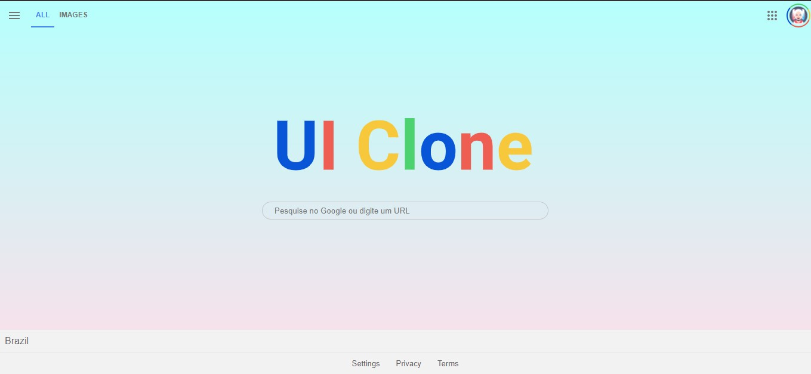

# UI(User Interface) do Google

_Descrição_: Desenvolvida a inteface do Google versão desktop através da videoaula da Rocketseat.

- Utilizada no CSS a metodologia BEM para construção da UI.
- O mesmo foi criado com HTML e CSS;

